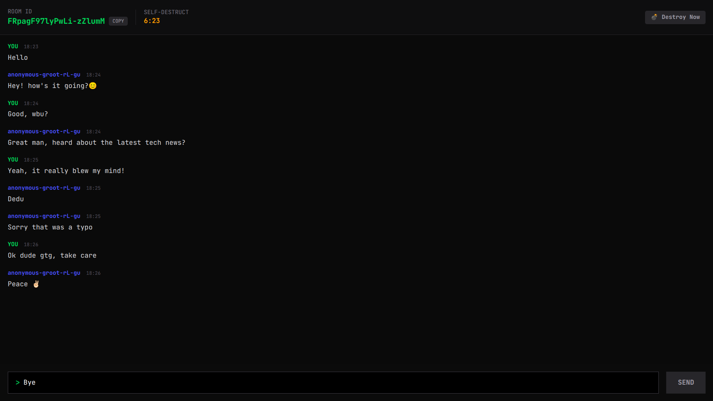

# Incognito Chat

Incognito Chat is a privacy-focused web application for creating temporary, self-destructing chat rooms.  

<p align="center">
  
</p>


Rooms and messages automatically expire, ensuring conversations are never stored permanently.

<p align="center">
  
</p>


## Features

- Temporary chat rooms with automatic deletion (10-minute TTL)
- Real-time messaging
- Anonymous users (no sign-up or accounts)
- Shareable room links
- Manual room destruction
- Maximum 50 users per room
- Live countdown until room expiration


## Tech Stack

**Frontend**
- Next.js
- React
- TypeScript
- Tailwind CSS
- TanStack Query

**Backend**
- Next.js API Routes
- Elysia.js (type-safe APIs)
- Upstash Redis
- Upstash Realtime (WebSockets)

**Other**
- Zod for validation
- Token-based authentication via HTTP-only cookies

## Getting Started
### Prerequisites
- Node.js 18+
- npm or yarn
- Upstash Redis & Realtime accounts
---
### Installation


```bash
git clone https://github.com/your-username/incognito-chat.git
cd incognito-chat
npm i
```

---
### Environment Variables

Create a .env file in the root directory:

```bash
UPSTASH_REDIS_REST_URL=
UPSTASH_REDIS_REST_TOKEN=
```

---
### Run Locally

```bash
npm run dev
```
Open http://localhost:3000 in your browser.

---
### Usage

1. Create a chat room from the homepage
2. Share the generated room link
3. Chat in real time
4. Room and messages auto-delete after expiration or manual destruction
---
### Deployment

Recommended platform: Vercel

Steps:

- Push the repository to GitHub
- Import the project into Vercel
- Add environment variables
- Deploy
 ---
### Possible Future Enhancements

- Room passwords / short access codes
- Message reactions & typing indicators
- Dark mode toggle
- Custom room expiration times
- QR code for mobile sharing

---
Made with ❤️ by Manav Dhamecha.